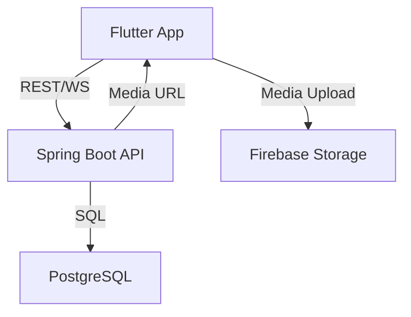

# CrimeNet

**Tagline:**  
_Revolutionizing collaborative crime-solving with real-time chat, secure media, and recruiter-driven case management._

---

## 🚀 Introduction

CrimeNet is a full-stack, modern platform designed for collaborative crime investigation and recruitment. Built with Flutter, Spring Boot, Firebase Storage, and PostgreSQL, it empowers investigators, recruiters, and applicants to work together seamlessly—featuring secure authentication, real-time communication, and robust media handling.

---

## ✨ Features

- **JWT-Based Authentication:** Secure login & signup for all users.
- **Case Management:** Create, view, and manage crime cases with rich details.
- **Media Uploads:** Attach images and videos to cases, stored securely in Firebase Storage.
- **Real-Time Chat:** WebSocket-powered messaging for users assigned to the same case.
- **Recruiter-Applicant Workflow:**  
  - Recruiters post cases with hourly rates and requirements.
  - Applicants apply directly; recruiters can view profiles and initiate private chats.
- **Commenting System:** Discuss and collaborate on cases.
- **Participation Tracking:** Monitor user involvement and case progress.
- **RESTful APIs:** Clean, scalable backend endpoints.
- **State Management:** Efficient UI updates using Provider in Flutter.

---

## 🛠️ Tech Stack

- **Frontend:** Flutter (Dart)
- **Backend:** Spring Boot (Java)
- **Database:** PostgreSQL
- **Media Storage:** Firebase Storage
- **Authentication:** JWT (JSON Web Token)
- **Real-Time:** WebSocket (STOMP)
- **State Management:** Provider (Flutter)

---

## 🏗️ Project Architecture



- **Flutter App:** Handles UI, state, and direct media uploads to Firebase.
- **Spring Boot API:** Manages authentication, business logic, and real-time chat.
- **PostgreSQL:** Stores user, case, and application data.
- **Firebase Storage:** Stores images and videos, serving URLs to the app.

---

## ⚡ Installation & Setup

### 1. Backend (Spring Boot)

```bash
# Clone the repo
git clone https://github.com/yourusername/crimenet.git
cd crimenet/app

# Configure PostgreSQL in src/main/resources/application.properties
# (Set DB URL, username, password)

# Build & run
./gradlew bootRun
```

### 2. Frontend (Flutter)

```bash
# In a new terminal
cd ../crimenet_frontend

# Install dependencies
flutter pub get

# Configure Firebase (add your google-services.json and Info.plist)

# Run the app
flutter run
```

---

## 🖼️ Screenshots

> _Add your own screenshots here!_

- 
- 
- 
- 
- 

---

## 💡 Unique Highlights

- **WebSocket Real-Time Chat:** Instant messaging for case collaborators.
- **Firebase Media Storage:** Secure, scalable image/video uploads.
- **Recruiter-Driven Workflow:** Modern hiring and application process for investigators.
- **Provider State Management:** Smooth, responsive UI.

---

## 📬 Contact

For questions or collaboration, reach out via [LinkedIn](https://www.linkedin.com/) or open an issue!

---

**Impress, inspire, and innovate with CrimeNet.** 